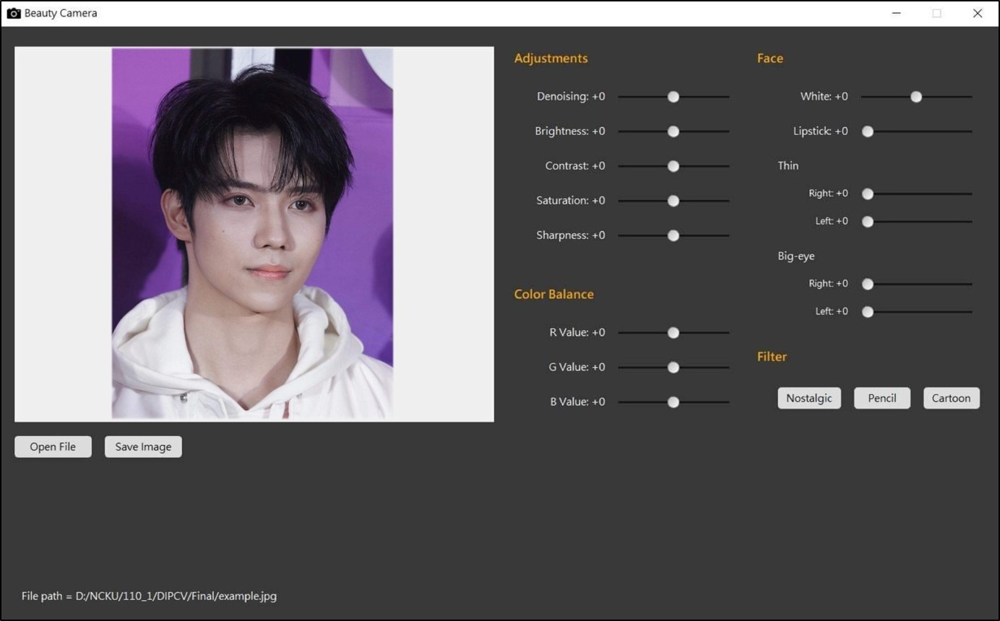

# Beauty Camera
**Author:**   
Ying-Jhu, Lu (re6101011@gs.ncku.edu.tw)  
Pei-Cheng, Li (h24074085@gs.ncku.edu.tw)  
Yun-Zhong, Jiang (re6101029@gs.ncku.edu.tw)

## Introduction
***
This is a beauty camera.   
- Adjustment
  - Brightness
  - Contrast
  - Saturation
  - Sharpness
- RGB
  - R
  - G
  - B
- Face (debug)
  - Lipstick
  - Thin
  - Big-eye
- Filter (debug)
  - Nostalgic
  - Pencil
  - Cartoon

## Getting started
***
### Requirements
Python 3.8 and Conda Environment  
You can install all the required packages using the following command: 

        pip install -r requirements.txt

### Running the code
#### Using the GUI

        python main.py

